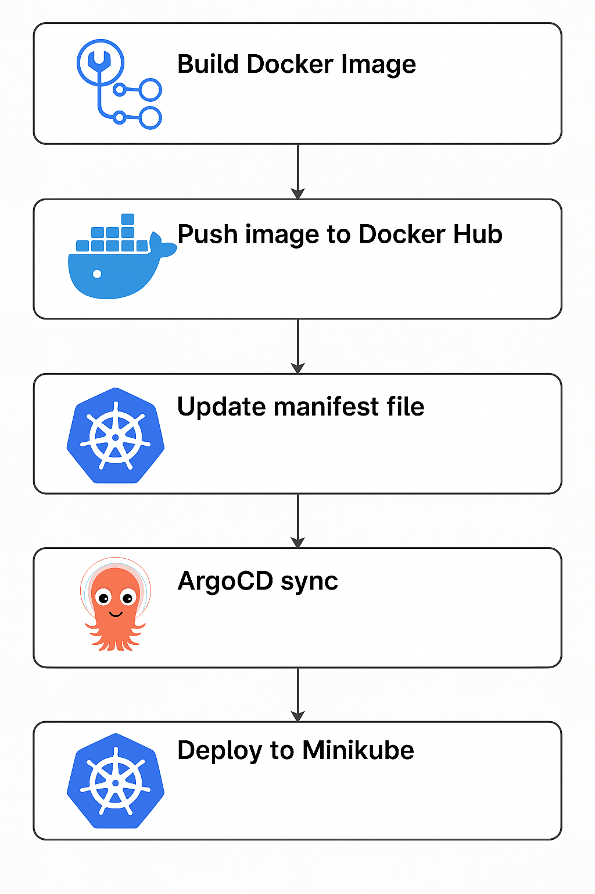

# Iris Dataset Model Training and Versioning

This project demonstrates how to train, version, and store machine learning models using the Iris dataset. The following sections provide details about the training process, model versioning approach, and storage structure.

---

## Model Training

The script uses the **Iris dataset** from the `sklearn` library, which is a well-known dataset for classification tasks. The key steps in the training process are:

1. **Data Splitting**:  
   The dataset is split into training and testing sets using `train_test_split` from `sklearn.model_selection`. Test dataset can be used later for checking accuracy. 

2. **Model Training**:  
   A **Logistic Regression** model is trained on the training data using `sklearn.linear_model.LogisticRegression`.

---

## Model Versioning

To experiment with different configurations of the Logistic Regression model, multiple versions of the model are created by varying the `max_iter` parameter. This parameter controls the maximum number of iterations for the solver to converge.

### Versioning Process:
- The `max_iter` parameter is incremented by 100 for each version (e.g., 200, 300, 400, etc.).
- For each value of `max_iter`, a new model is trained.
- This results in multiple versions of the model, each with a unique configuration.

---

## Storing Versions

Each version of the trained model is serialized and saved as a `.pkl` file using the `joblib` library. To organize these versions effectively:

- Each version is stored in a subdirectory under a main `models/` directory.
- Subdirectories are named after their respective version (e.g., `v1/`, `v2/`, etc.).
- This hierarchical structure makes it easy to identify and retrieve specific model versions.

### Example Directory Structure:
The models are stored in the following format:

```
models/
├── v1/
│ └── iris_model.pkl
├── v2/
│ └── iris_model.pkl
├── v3/
│ └── iris_model.pkl
├── v4/
│ └── iris_model.pkl
└── v5/
└── iris_model.pkl
```


---

# CI/CD Pipeline: Build, Push, and Update Deployment

This repository includes a GitHub Actions workflow to automate building, pushing, and deploying Docker images based on changes to the `main` branch.

---

## 📦 Workflow Overview

The GitHub Actions pipeline performs the following steps:

1. **Trigger**: Runs on push or pull request to the `main` branch, and can be manually triggered via `workflow_dispatch`.
2. **Checkout Code**: Fetches the repository.
3. **Docker Setup**: Prepares Docker Buildx for advanced builds.
4. **Login to DockerHub**: Authenticates using secrets.
5. **Get Model Version**: Detects the latest model version from the `models/` directory.
6. **Build & Push Image**: Builds the Docker image using the model version and pushes both `:latest` and version-specific tags to DockerHub.
7. **Update Kubernetes Deployment**: Updates `k8s/deployment.yaml` with the new Docker image tag.
8. **Commit Deployment File Change**: Automatically commits the updated deployment file back to the repo.

---

## 🖼️ Pipeline Flow



---

## 🛠️ Secrets Required

Following GitHub secrets are set  repository:

- `DOCKERHUB_USERNAME` — Docker Hub username
- `DOCKERHUB_TOKEN` — Docker Hub access token

---

## 🐳 Docker Image Info

Images are built and pushed to:  [DockerHub Repository](https://hub.docker.com/repository/docker/dhanush789245/ml/general)
